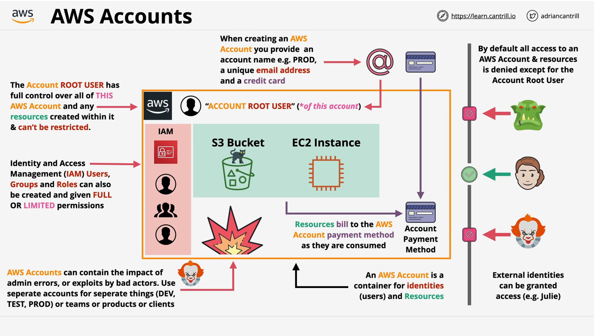

# **AWS Accounts Fundamentals** 

> An AWS account is a container for identities (users) and resources.

To create an AWS account you provide an account name (e.g. `PROD`), a unique email address and a payment method. The email must be unique to that account, but the same payment method can be reused across accounts. That email address creates a special identity called the **account root user**, so every AWS account has exactly one root user.

The root user has full control over the account and everything created inside it, and those permissions can't be restricted.

AWS is pay-as-you-go: you pay for what you use.

Unlike the root user, any additional identities you create *can* be restricted. That's handled by **IAM** (Identity and Access Management), which lets you create users, groups and roles and give each of them full or limited access, but only within that one account.

### Multi-factor Authentication (MFA)

- A username and password alone is weak: if it leaks, anyone can impersonate you.
- **Factors** are the different pieces of evidence that prove your identity:
  - **Knowledge**: something you know (username & password).
  - **Possession**: something you have (bank card, MFA device or app).
  - **Inherent**: something you are (fingerprint, face, voice).
  - **Location**: somewhere you are (e.g. on the corporate Wi-Fi).
- More factors means more security, and a much harder identity to fake.

### Identity and Access Management basics (IAM)

The root user has full, unrestricted access to the account. In the real world you don't hand that out. You grant a developer only the access they need to do their job, for example to deploy an application. That's **least-privilege access**: give an identity the minimum permissions required to complete its task. If root credentials leak, the entire account is at risk.

Every AWS account comes with its own copy of IAM, its own identity database. IAM is a **globally resilient** service: its data is replicated securely across all AWS regions (likely exam material).

**The three IAM identity types:**

- **User**: a human or an application that needs access to your account.
- **Group**: a collection of related users, e.g. `Developers`.
- **Role**: assumed by AWS services, or used to grant external access to your account.

**IAM policy**: allows or denies access to AWS services. It only takes effect once attached to a user, group or role.

**Things to remember:**

- IAM is an identity provider (IDP): it **authenticates** (proves who you are) and **authorizes** (allows or denies access to a resource).
- IAM itself costs nothing.
- IAM is a global service with global resilience.
- IAM only allows or denies its own identities within its own AWS account.
- IAM has no direct control over external accounts or users.
- IAM supports identity federation and MFA.

### IAM Access Keys

Access keys are **long-term credentials** used to access AWS from outside the console (CLI, SDKs, API). They don't rotate automatically: it's on the owner to update them.

An access key has two parts:

- **Access key ID**: like a username.
- **Secret access key**: like a password.

AWS gives you both when the key is created, but the secret is shown **only once**. If you lose it, you can't recover it, you have to create a new key.

**Things to remember:**

- A console password on an IAM user is optional.
- An IAM user can have at most one username and one password.
- An IAM user can have a maximum of **two** access keys at a time.
- Access keys can be created, deleted, made inactive or made active again.